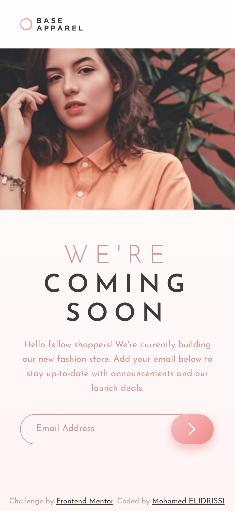
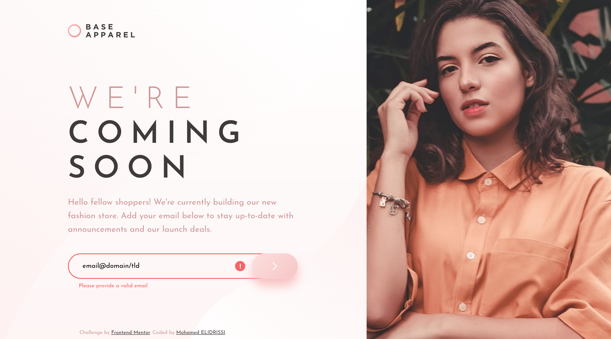

# Frontend Mentor - Base Apparel coming soon page solution

This is a solution to the [Base Apparel coming soon page challenge on Frontend Mentor](https://www.frontendmentor.io/challenges/base-apparel-coming-soon-page-5d46b47f8db8a7063f9331a0). Frontend Mentor challenges help you improve your coding skills by building realistic projects. 

## Table of contents

- [Overview](#overview)
  - [The challenge](#the-challenge)
  - [How to build](#how-to-build)
  - [Screenshot](#screenshot)
  - [Links](#links)
- [My process](#my-process)
  - [Built with](#built-with)
  - [Useful resources](#useful-resources)
- [Author](#author)
- [License](#license)

## Overview

### The challenge

Users should be able to:

- View the optimal layout for the site depending on their device's screen size
- See hover states for all interactive elements on the page
- Receive an error message when the `form` is submitted if:
  - The `input` field is empty
  - The email address is not formatted correctly

### How to build

This project uses Parcel bundler, so building only takes a few steps! 

- Clone the repository:
```sh
$ git clone https://github.com/elidrissidev/base-apparel-coming-soon.git
```
- Install the dependencies with NPM:
```sh
$ npm install
```
- Start the development server:
```sh
$ npm run start
```
- Or, build the website for production:
```sh
$ npm run build
```

### Screenshot

| Mobile (375px) | Desktop (1440px) |
| --- | --- |
|  |  |

### Links

- Solution URL: [Add solution URL here](https://your-solution-url.com)
- Live Site URL: [Add live site URL here](https://your-live-site-url.com)

## My process

### Built with

- Semantic HTML5 markup
- CSS custom properties
- Flexbox
- Mobile-first workflow
- [Parcel](https://parceljs.org/)

### Useful resources

- [Animate Blend Mode with opacity and transition](https://stackoverflow.com/a/45502783) - This helped me fix the on-hover background transition of the form submit button, I was able to achieve that by using `background-blend-mode` and animating the `background-color` from `transparent` to a transparent white on hover.

## Author

- Website - [Mohamed ELIDRISSI](https://www.elidrissi.dev)
- Frontend Mentor - [@elidrissidev](https://www.frontendmentor.io/profile/elidrissidev)

## License

This project is licensed under the [MIT Licensed](LICENSE.txt).
